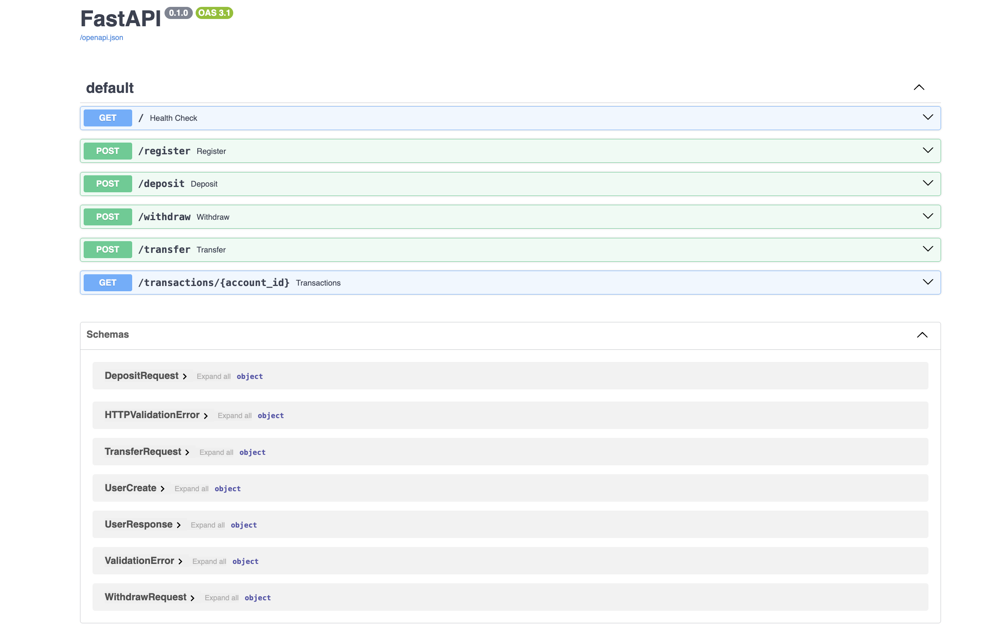
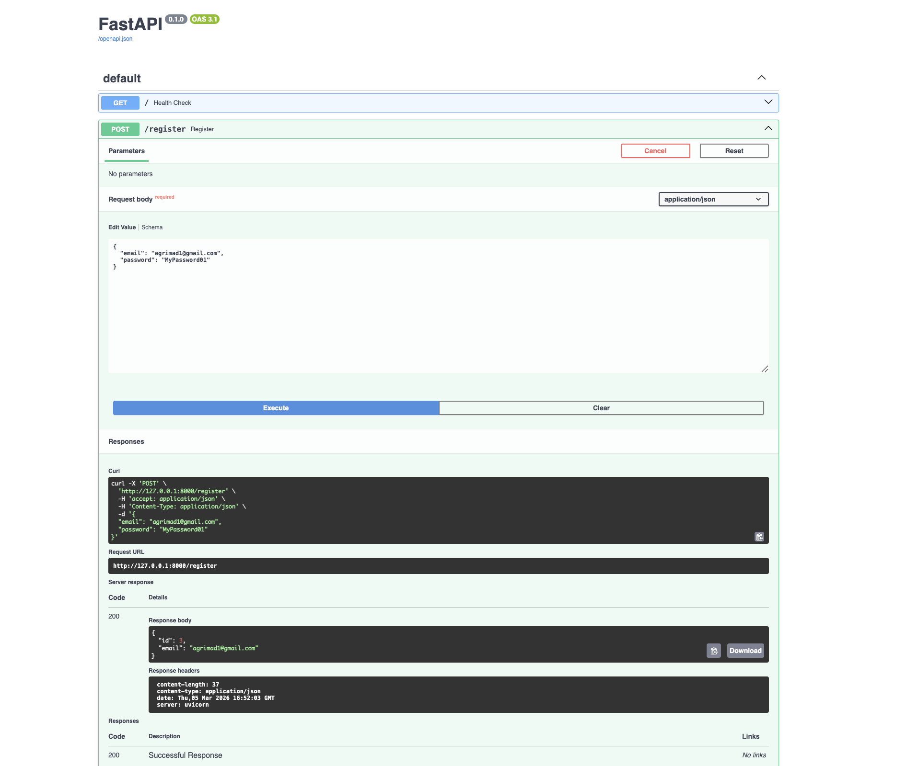
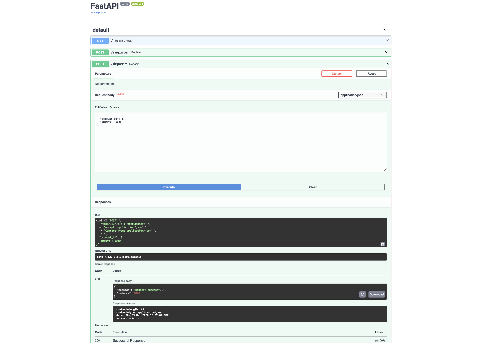
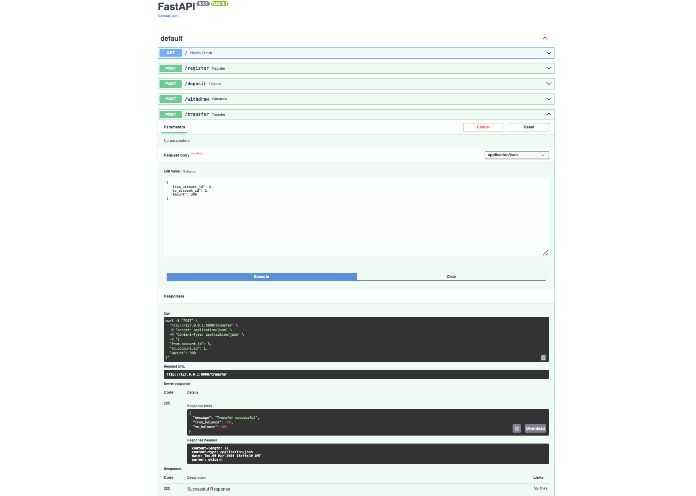
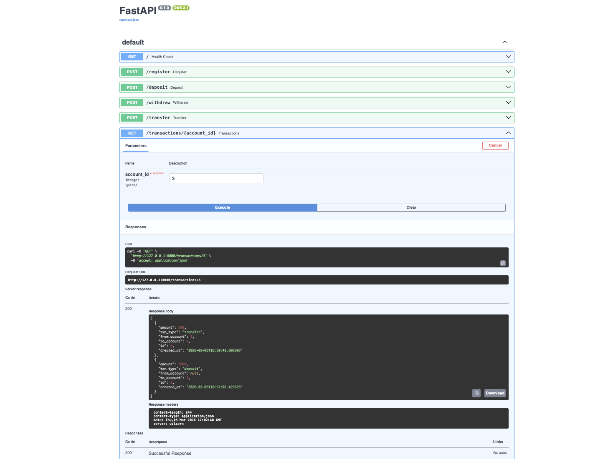

# FastAPI Banking API


A RESTful backend API that simulates basic banking operations such as user registration, deposits, withdrawals, transfers, and transaction history tracking.

The project is built using FastAPI and SQLAlchemy and demonstrates backend development concepts including API design, database modeling, and transaction logging.

This project demonstrates basic backend development concepts such as:

- User registration
- Account creation
- Deposits
- Withdrawals
- Money transfers
- Transaction history

The API simulates basic banking operations and logs all transactions.

---

## Tech Stack

- Python
- FastAPI
- SQLAlchemy
- SQLite
- Uvicorn
- Pydantic

---

## Project Structure

```
banking-api/

main.py — API routes and business logic  
models.py — database models  
schemas.py — request and response schemas  
database.py — database connection setup  
requirements.txt — project dependencies
```

---

## Installation

### Clone the repository

```bash
git clone https://github.com/rutujad9/fastapi-banking-api.git
```

---

### Navigate to the project folder

```bash
cd fastapi-banking-api
```

---

### Create virtual environment

```bash
python -m venv venv
source venv/bin/activate
```

---

### Install dependencies

```bash
pip install -r requirements.txt
```

---

## Run with Docker

Build the Docker image:

docker build -t fastapi-banking-api .

Run the container:

docker run -p 8000:8000 fastapi-banking-api

---

## Run the API

### Start the server

```bash
uvicorn main:app --reload
```

---

## Open the API docs

```
http://127.0.0.1:8000/docs
```

FastAPI automatically generates interactive documentation.

---

## Example Features

### Register User
Creates a new user and automatically creates a bank account.

### Deposit Money
Adds money to an account.

### Withdraw Money
Removes money from an account if sufficient balance exists.

### Transfer Money
Transfers funds between two accounts.

### Transaction History
View all transactions related to an account.

---

## Example API Endpoints

POST `/register` — create new user  
POST `/deposit` — deposit money  
POST `/withdraw` — withdraw money  
POST `/transfer` — transfer funds  
GET `/transactions/{account_id}` — view transaction history  

---

## How to Test the API

1. Start the server:

```
uvicorn main:app --reload
```

2. Open the interactive API documentation:

```
http://127.0.0.1:8000/docs
```

3. Use the Swagger interface to test endpoints such as:

- Register a user
- Deposit money
- Withdraw money
- Transfer money between accounts
- View transaction history

---

## API Documentation

Once the server is running, open:

http://127.0.0.1:8000/docs

FastAPI automatically generates interactive API documentation where you can test all endpoints.

---

## API Preview

### Swagger API Documentation


### Register User


### Deposit Money


### Transfer Funds


### Transaction History


## Author

Rutuja Deshmukh  
MSc Informatik — Germany